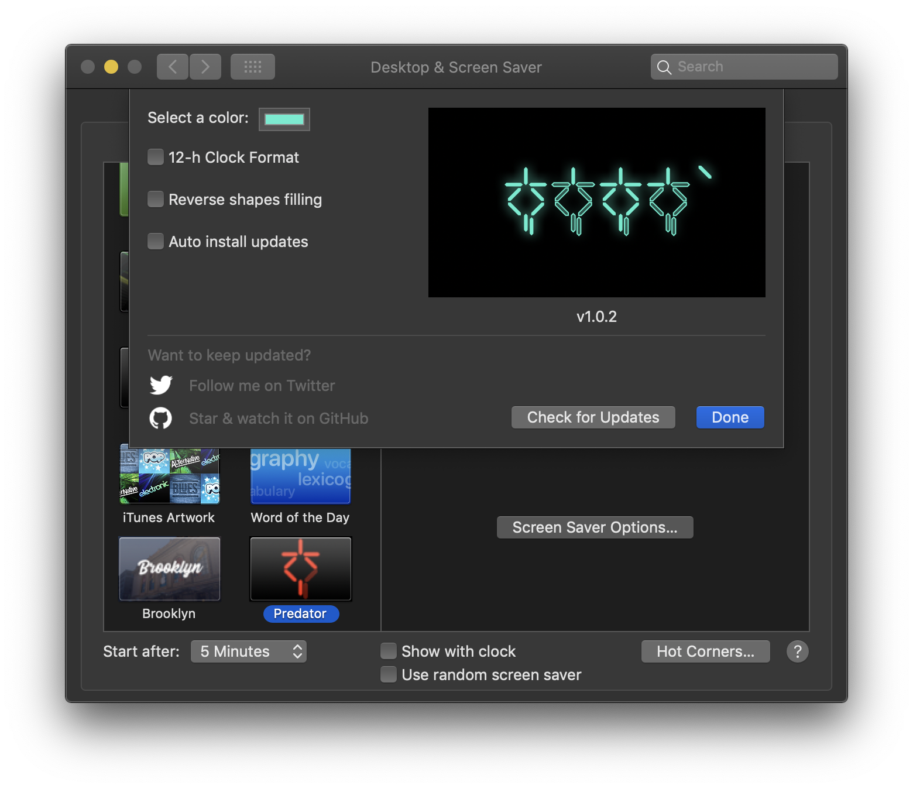

  
  
  
  

# Predator

**Predator** is a minimalistic screensaver for macOS based on predator's countdown time. Feel free to contrubute!

## Compatibility

Requires OS X El Capitan 10.11 and newer

## Features

- Reverse filling
- 12 and 24-hour clock support
- Color selection

  

## Installation

1. Click [here](https://github.com/vpeschenkov/Predator/releases/download/1.0.2/Predator.saver.zip) to download the latest release
2. Open **Predator.saver** (double click)
3. `"Predator.saver" can't be opened because it is from an unidentified developer` will appear, press `OK`
4. Open `Preferences`
5. Select `Security & Privacy`
6. Select `General`
7. On the bottom side, select `Open Anyway`

**Important**: If you haven't quit System Preferences before installation and were upgrading from a previous version, I strongly recommend you quit the application after installation, then reopen it, as updated Swift screensavers aren't loaded correctly in an active System Preferences session.

## Uninstallation 

- Right-click on Predator in System Preferences and select `Delete Predator`, or
- Delete `PredatorClock.saver` either in `/Library/Screen Savers` or `/Users/USERNAME/Library/Screen Savers`.

## How to read the clock or the clock rules

The rules are pretty simple, and you wouldn't spend much time to learn them.

### 24-hour clock rules

#### 1 digits (0-2)

| 0                                                                     | 1                                                                     | 2                                                                      |
|-----------------------------------------------------------------------|-----------------------------------------------------------------------|------------------------------------------------------------------------|
|  |  |   |

#### 3 digits (0-5)

| 0                                                                     | 1                                                                     | 2                                                                     | 3                                                                     | 4                                                                     |
|-----------------------------------------------------------------------|-----------------------------------------------------------------------|-----------------------------------------------------------------------|-----------------------------------------------------------------------|-----------------------------------------------------------------------|
|  |  |  |  |  |

| 5                                                                     |
|-----------------------------------------------------------------------|
|  |

#### 2 & 4 digits (0-9)

| 0                                                                                 | 1                                                                                 | 2                                                                                 | 3                                                                                 | 4                                                                                 |
|-----------------------------------------------------------------------------------|-----------------------------------------------------------------------------------|-----------------------------------------------------------------------------------|-----------------------------------------------------------------------------------|-----------------------------------------------------------------------------------|
|  |  |  |  |  |

| 5                                                                                 | 6                                                                                 | 7                                                                                 | 8                                                                                 | 9                                                                                 |
|-----------------------------------------------------------------------------------|-----------------------------------------------------------------------------------|-----------------------------------------------------------------------------------|-----------------------------------------------------------------------------------|-----------------------------------------------------------------------------------|
|  |  |  |  |  |

### 12-hour clock rules

#### 1 digits (0-1)

| 0                                                                     | 1                                                                     |
|-----------------------------------------------------------------------|-----------------------------------------------------------------------|
|  |  |

#### 3 digits (0-5)

| 0                                                                     | 1                                                                     | 2                                                                     | 3                                                                     | 4                                                                     |
|-----------------------------------------------------------------------|-----------------------------------------------------------------------|-----------------------------------------------------------------------|-----------------------------------------------------------------------|-----------------------------------------------------------------------|
|  |  |  |  |  |

| 5                                                                     |
|-----------------------------------------------------------------------|
|  |

#### 2 & 4 digits (0-9)

| 0                                                                                 | 1                                                                                 | 2                                                                                 | 3                                                                                 | 4                                                                                 |
|-----------------------------------------------------------------------------------|-----------------------------------------------------------------------------------|-----------------------------------------------------------------------------------|-----------------------------------------------------------------------------------|-----------------------------------------------------------------------------------|
|  |  |  |  |  |

| 5                                                                                 | 6                                                                                 | 7                                                                                 | 8                                                                                 | 9                                                                                 |
|-----------------------------------------------------------------------------------|-----------------------------------------------------------------------------------|-----------------------------------------------------------------------------------|-----------------------------------------------------------------------------------|-----------------------------------------------------------------------------------|
|  |  |  |  |  |

#### AM/PM

| AM     | PM     |
|--------|--------|
| ![][AM]| ![][PM]|

## Contributing

- If you **need help** or you'd like to **ask a general question**, open an issue.
- If you **found a bug**, open an issue.
- If you **have a feature request**, open an issue.
- If you **want to contribute**, submit a pull request.

## Author

Victor Peschenkov, v.peschenkov@gmail.com

## License

`PredatorClock` is available under the Apache 2.0 license. See the [LICENSE](LICENSE) file for more info.

[AM]: Screenshots/AM:PM/AM.png
[PM]: Screenshots/AM:PM/PM.png
