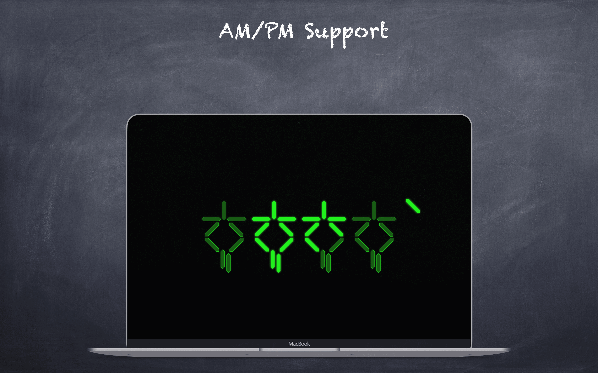
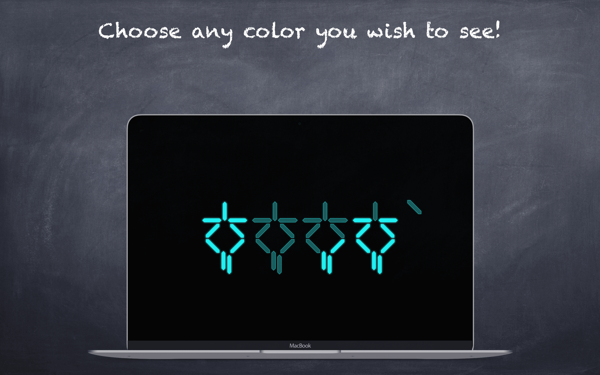

  
  
  
  

# Predator

If you are a fan of the science-fiction film Predator, this screensaver is for you! It will transport you back to those nostalgicically memorable years and transform your Mac into a Predator clock. Don't worry, your Mac won't blow up 😄

It is completely open source, feel free to contribute!

## Compatibility

Requires OS X El Capitan 10.12 or above

## Installation

- Download the latest release of Predator from the following [link](https://github.com/vpeschenkov/Predator/releases/download/1.0.6/Predator.saver.zip)
- Double-click the downloaded file, named Predator.saver
- If you see the message "Predator.saver" can't be opened because it is from an unidentified developer, click OK
- Open the Preferences app
- Select the Security & Privacy option
- In the General tab, you should see a message near the bottom of the window that says Predator.saver was blocked from opening because it is not from an identified developer. Click the Open Anyway button to allow the app to run.

If you see an error message saying "This app is damaged and can't be opened, you should move it to the trash", download the file with Safari, to prevent macOS Gatekeeper from throwing that error. Note that some outdated unzip software may cause that issue too.

**Important**: If you haven't quit System Preferences before installation and were upgrading from a previous version, I strongly recommend you quit the application after installation, then reopen it, as updated Swift screensavers aren't loaded correctly in an active System Preferences session.

## Features

- Customize the color of the clock to your preference
- Select between 12-hour and 24-hour clock formats
- Remove unnecessary lines to achieve the look of the clock in the movie
- Additional features and customization options are also available 🙂
  

## Predator’s clock rules

The rules are pretty simple, and you wouldn’t spend much time to learn them:

## Uninstallation 

- Right-click on Predator in System Preferences and select `Delete Predator`, or
- Delete `PredatorClock.saver` either in `/Library/Screen Savers` or `/Users/USERNAME/Library/Screen Savers`.

## Contributing

- If you **need help** or you'd like to **ask a general question**, open an issue.
- If you **found a bug**, open an issue.
- If you **have a feature request**, open an issue.
- If you **want to contribute**, submit a pull request.

## Author

Victor Peschenkov, v.peschenkov@gmail.com

## License

`PredatorClock` is available under the Apache 2.0 license. See the [LICENSE](LICENSE) file for more info.
