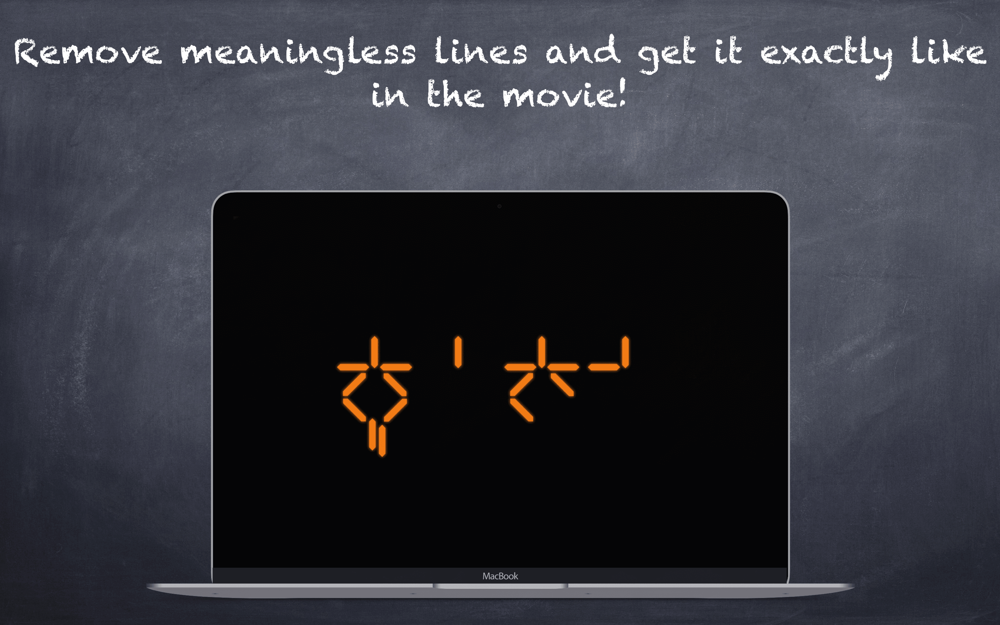
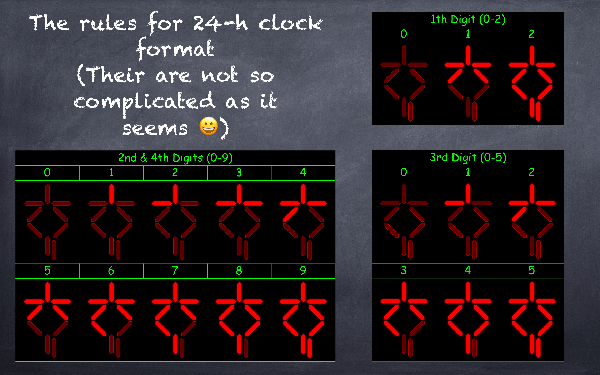

  
  
  
  

# Predator

Relive the iconic sci-fi vibes of Predator!
This screensaver turns your Mac into a stylish Predator-style clock — just like in the movie.
Don’t worry, your Mac won’t self-destruct 😄

> Completely open-source — contributions are welcome!

## Compatibility

Requires macOS 11.5 or newer

## Installation

- Download the latest release of Predator from the following [link](https://github.com/vpeschenkov/Predator/releases/download/1.0.6/Predator.saver.zip)
- Double-click the downloaded file, named Predator.saver
- If you see the message "Predator.saver" can't be opened because it is from an unidentified developer, click OK
- Open the Preferences app
- Select the Security & Privacy option
- In the General tab, you should see a message near the bottom of the window that says Predator.saver was blocked from opening because it is not from an identified developer. Click the Open Anyway button to allow the app to run.

If you see an error message saying "This app is damaged and can't be opened, you should move it to the trash", download the file with Safari, to prevent macOS Gatekeeper from throwing that error. Note that some outdated unzip software may cause that issue too.

> ⚠️ Tip: After installing or upgrading, quit and reopen System Preferences to ensure proper loading

## Features

- Fully customizable clock colors
- Switch between 12-hour and 24-hour formats
- Optional movie-accurate appearance by hiding UI elements
- Designed with flexibility and nostalgia in mind
  

## How the Clock Works

No need to learn Yautja language — the Predator clock rules are easy to grasp:

## Uninstallation 

- Right-click on Predator in System Preferences and select `Delete Predator`, or
- Delete `PredatorClock.saver` either in `/Library/Screen Savers` or `/Users/USERNAME/Library/Screen Savers`.

## Contributing

Want to help improve Predator? Contributions are welcome!

- 📌 Found a bug? [Open an issue](https://github.com/vpeschenkov/Predator/issues)
- 💡 Have an idea? [Share a feature request](https://github.com/vpeschenkov/Predator/issues)
- 👨‍💻 Ready to code? [Submit a pull request](https://github.com/vpeschenkov/Predator/pulls)

## Author

Victor Peschenkov, v.peschenkov@gmail.com

## License

`PredatorClock` is available under the Apache 2.0 license. See the [LICENSE](LICENSE) file for more info.

## Keywords

`macOS screensaver`, `Predator screensaver`, `sci-fi clock`, `Swift screensaver`,  
`digital clock`, `Predator movie gadget`, `custom clock screensaver`, `retro tech`,  
`open source mac screensaver`, `alien countdown clock`
